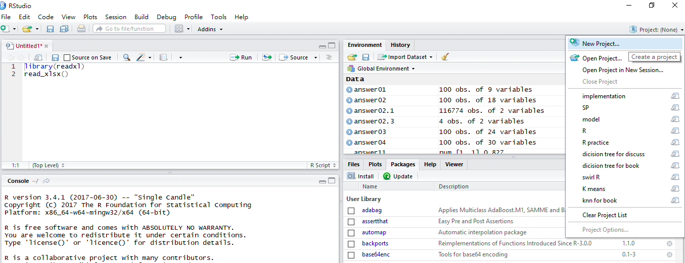
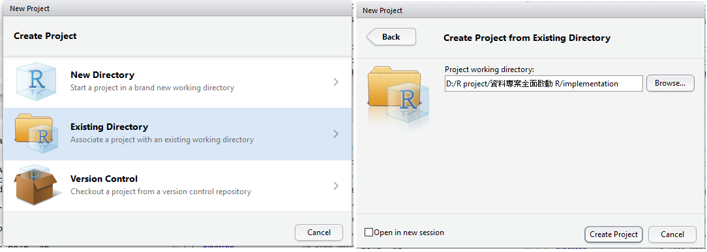

```{r setup, include=FALSE}
# install.packages("knitr")
knitr::opts_chunk$set(echo = TRUE,                      
                      warning=FALSE,
                      message=FALSE,
                      out.width ='500px',
                      out.height ='500px')
```

## 載入實作練習包
- 先確認您的電腦安裝了[R](http://cran.csie.ntu.edu.tw/) 與 [R studio](https://www.rstudio.com/products/rstudio/download/#download)
- 將請到本頁面中點選下載zip，將課程包下載到自己的電腦中
- 解開壓縮後點擊 fpp.Rproj 已開啟實作練習教材


## 新增一個R專案 (.Rproj)

- 打開R studio，建立一個新專案，指定路徑到你的工作路徑



##   資料下載與匯入

- 將資料下載下來，儲存到自己的工作目錄
- 使用 `read.csv` 匯入資料
- 建議把游標移到`" "` (雙引號) 裡面按Tab鍵選取檔案
```{r}

url_EPA <- 
url_TARI

download.file(url_EPA, destfile = "環保署列管污染農地_big5.csv")
download.file(url_TARI, destfile = "農地重金屬超標未列管_big.csv")

data_EPA <- read.csv("環保署列管污染農地_big5.csv", fileEncoding = "big5")
data_TARI <- read.csv("農地重金屬超標未列管_big.csv", fileEncoding = "big5")
```

---

##PART1--環保署資料 (2016) 實作


### **1.使用dplyr 套件重現敘述統計表**
 
```{r}
# install.packages("dplyr")
library(dplyr)
#因為沒有全部要用，擷取需要用到的資訊，並另外命名為英文
data_EPA <- data_EPA %>% select(county=1, coordinate=3, area=7, control_date=8, free_date=10)

summarise_data <- data_EPA %>% group_by(county) %>% 
  summarise(count = n(), 
            sum_area = sum(area), 
            control_area = sum(area[free_date=="無"]), 
            free_area = sum(area[free_date!="無"]), 
            count_control = sum(free_date=="無"), 
            count_free = sum(free_date!="無")) %>% 
  mutate(avg_area = sum_area/count, 
         ratio_control = sprintf("%1.0f%%",count_control/count*100),
         ratio_free = sprintf("%1.0f%%",count_free/count*100))
```

### **2.計算平均列管月份**

```{r}
#把列管時間轉成日期格式
data_EPA$control_date <- data_EPA$control_date %>% as.Date()
data_EPA$free_date <- data_EPA$free_date %>% as.Date()
#把尚未解除列管的時間帶資料收集截止時間"2016-12-18"，以便計算列管時間
data_EPA$free_date <- replace(data_EPA$free_date,which(is.na(data_EPA$free_date)),as.Date("2016-12-18"))

#計算列管月份
data_EPA$totol_month <- NA
for(i in 1:nrow(data_EPA)){
  tryCatch({ #因為資料裡有其中一筆沒有列管時間，我們加tryCatch讓他忽略錯誤，讓迴圈可以正常執行完
  data_EPA$totol_month[i] <- 
    length(seq(from=data_EPA$control_date[i], to=data_EPA$free_date[i], by='month')) 
  }, error=function(e){})
}

#計算各縣市列管中與解除列管的平均列管月份
avg_month <- data_EPA %>% group_by(county) %>% 
  summarise(control_month = mean(totol_month[free_date=="2016-12-18"]) %>% round(), 
            free_month = mean(totol_month[free_date!="2016-12-18"],na.rm = TRUE)%>% 
              round()) #因為資料中有一筆沒有列管時間，因此把參數na.rm改為TRUE，才可以運算

#把無列管中的平均月份帶0
avg_month[is.na(avg_month)] <- 0

#合併回summarise_data
summarise_data <- summarise_data %>% left_join(avg_month, by="county")
```

### **3.計算全國加總**
```{r}
tmp <- colSums(summarise_data[,2:8]) %>% t() %>% as.data.frame() %>% 
  mutate(ratio_control = sprintf("%1.0f%%",count_control/count*100),
         ratio_free = sprintf("%1.0f%%",count_free/count*100)) %>% 
  cbind(.,colMeans(summarise_data[,11:12])%>% round() %>% t() %>% as.data.frame()) %>%
  mutate(county="全國") %>% 
  select(12,1:11)
summarise_data <- rbind(tmp, summarise_data)
```


```{r echo=FALSE}
# install.packages("kableExtra")
summarise_data %>% knitr::kable(.,format = "html") %>% kableExtra::kable_styling(bootstrap_options = "striped", font_size = 12) %>% kableExtra::scroll_box(width = "750px", height = "350px")
```

### **4.使用plotly 套件繪製統計圖表**

- Bar Chart
```{r out.height ='400px'}
# install.packages("plotly")
library(plotly)

plot_ly( summarise_data, x = ~county, y = ~count_control, type = "bar") %>% 
  layout(title = "所有案件",
         xaxis = list(title = 'county'),
         yaxis = list(title = 'count'),
         width = 750, height = 400)
```

- Grouped Bar Chart
- with Hover Text and Rotated Labels
```{r out.height ='400px'}
plot_ly(summarise_data, x = ~county, y = ~count_control, type = 'bar',
        name = '列管案件', text = ~ratio_control) %>%
  add_trace(y = ~count_free, name = '解除列管案件', text = ~ratio_free) %>%
  layout(xaxis = list(title = "", tickangle = -45), 
         yaxis = list(title = 'count'), barmode = 'group',
         width = 800, height = 400)
```

- Pie Chart
```{r fig.height = 4, fig.width = 4}
#列管縣市太多，很多面積很小，取場址面積大於中位數的來畫圖
summarise_data1 <- summarise_data %>% arrange(sum_area %>% desc) %>% filter(sum_area > median(sum_area))
plot_ly(summarise_data1, labels = ~county, values = ~sum_area, type = 'pie',
        textinfo = 'label+percent') %>% layout(title = '場址面積總和',  width = 800, height = 500,
                                               margin=list(l = 100, r = 50, b = 100,t = 100,pad = 4))
```

### **5.場址座標轉經緯度**

- 將經緯度資訊從TWD07轉為WGS84

- 先下載[轉碼程式包](https://github.com/snexuz/TWD97TM2toWGS84)並執行
```{r echo=FALSE, results='hide'}
TWD97TM2toWGS84 <- function (input_lat, input_lon){  
  # input_lat: TWD97橫座標, 南北緯度, latitude N
  # input_lon: TWD97縱座標, 東西經度, longitude E
  input_lat <- input_lat %>% as.character %>% as.numeric()
  input_lon <- input_lon %>% as.character %>% as.numeric()
  
  a = 6378137.0
  b = 6356752.314245
  lon0 = 121 * pi / 180
  k0 = 0.9999
  dx = 250000
  dy = 0
  e = (1 - b^2 / a^2)^0.5
  x =  input_lat - dx # input_lat: TWD97橫座標, 緯度, latitude
  y =  input_lon - dy # input_lon: TWD97縱座標, 經度, longitude
  M = y/k0
  mu = M/(a*(1.0 - ( e**2 )/4.0 - 3* (e**4)/64.0 - 5* (e**6)/256.0))
  e1 = (1.0 -  ((1.0 -  (e**2))**0.5)) / (1.0 +  ((1.0 -  (e**2))**0.5))
  J1 = (3*e1/2 - 27* (e1**3)/32.0)
  J2 = (21* (e1**2)/16 - 55* (e1**4)/32.0)
  J3 = (151* (e1**3)/96.0)
  J4 = (1097* (e1**4)/512.0)
  fp = mu + J1*sin(2*mu) + J2*sin(4*mu) + J3*sin(6*mu) + J4*sin(8*mu)
  e2 =  ((e*a/b)**2)
  C1 =  (e2*cos(fp)**2)
  T1 =  (tan(fp)**2)
  R1 = a*(1- (e**2))/ ((1- (e**2)* (sin(fp)**2))**(3.0/2.0))
  N1 = a/ ((1- (e**2)* (sin(fp)**2))**0.5)
  D = x/(N1*k0)
  
  #緯度計算 latitude
  Q1 = N1*tan(fp)/R1
  Q2 = ( (D**2)/2.0)
  Q3 = (5 + 3*T1 + 10*C1 - 4* (C1**2) - 9*e2)* (D**4)/24.0
  Q4 = (61 + 90*T1 + 298*C1 + 45* (T1**2) - 3* (C1**2) - 252*e2)* (D**6)/720.0
  lat = fp - Q1*(Q2 - Q3 + Q4)
  
  #經度計算 longitude
  Q5 = D
  Q6 = (1 + 2*T1 + C1)* (D**3)/6
  Q7 = (5 - 2*C1 + 28*T1 - 3* (C1**2) + 8*e2 + 24* (T1**2))* (D**5)/120.0
  lon = lon0 + (Q5 - Q6 + Q7)/cos(fp)
  lat = (lat*180) /pi #南北緯度  latitude 
  lon = (lon*180)/ pi #東西經度  longitude
  WGS = list(lat = lat, lon = lon)
  return(WGS)
}
```

- 把經緯度資訊抓出來，分割成x軸與y軸
```{r}
head(data_EPA,3) #可以看到座標欄位裡面有：和，
TWD97 <- data_EPA$coordinate %>% as.character() %>% 
  stringr::str_split(.,'[，：]',simplify = TRUE) %>% 
  as.data.frame(., stringsAsFactors=FALSE) %>% select(x=2,y=4) 
```

- 利用轉碼函式將TWD97座標轉成經緯度座標系統
```{r}
WGS84 <- TWD97TM2toWGS84(TWD97$x, TWD97$y) %>% as.data.frame()

#合併回原本的data
data_EPA$coordinate <- NULL
data_EPA <- cbind(data_EPA,TWD97,WGS84)
head(data_EPA)
```

---

##PART2--農試所資料實作

### **1.重金屬轉換公式**
```{r}
data_TARI <- data_TARI %>% mutate(CUAR= 2.035*CU + 11.884,
                     CUAR_OVER = ifelse(CUAR>200,1,0),
                     ZNAR = 2.487*ZN + 89.711,
                     ZNAR_OVER = ifelse(ZNAR>600,1,0),
                     CDAR = 1.4578 *CD + 0.0323,
                     CDAR_OVER = ifelse(CDAR>5,1,0),
                     CRAR = 17.35 * CR+ 31.91,
                     CRAR_OVER = ifelse(CRAR>250,1,0),
                     NIAR = 5.13 * NI+ 14.56,
                     NIAR_OVER = ifelse(NIAR>200,1,0),
                     PBAR = 2.811 *PB+ 6.715,
                     PBAR_OVER = ifelse(PBAR>500,1,0),
                     OVER = ifelse(CUAR_OVER+ZNAR_OVER+CDAR_OVER+CRAR_OVER+
                                     NIAR_OVER+PBAR_OVER>=1,1,0))

```

### **2.計算農地樣區是否有超標情形**

```{r}
data_EPA_monitor<- data_EPA%>% filter(free_date=="2016-12-18")
for(i in 1:nrow(data_TARI)){
  data_TARI$mindistance[i]= min(na.exclude(sqrt((data_TARI$XLO[i]-as.integer(data_EPA_monitor$x))^2+(data_TARI$YLO[i]-as.integer(data_EPA_monitor$y))^2)))
}

for(i in 1:nrow(data_TARI)){
  data_TARI$minover[i] <- sum(na.exclude(sqrt((data_TARI$XLO[i]-data_TARI$XLO)^2+(data_TARI$YLO[i]-data_TARI$YLO)^2))<=1000)
}

data_TARI <- data_TARI %>% mutate(Is_monitored=ifelse(mindistance<=200,1,0))
```


### **3.與環保署的資料合併，計算統計指標**

```{r}
library(scales)
stat_over <- data_TARI %>% group_by(V2) %>%
  summarise(`重金屬超標`=sum(OVER),
            `超標未列管`=sum(ifelse(OVER+Is_monitored==1,1,0))) %>%
  mutate(`超標未列管比例`=percent(`超標未列管`/`重金屬超標`),
         `超標列管比例`=percent(1-`超標未列管`/`重金屬超標`))

```

---

##PART3--用leaflet畫地圖

### 地圖一：兩份資料交叉比對

```{r　out.width ='600px', out.height ='700px'}
# install.packages("leaflet")
library(leaflet)

#先把要點上圖的資料篩選出來
EPA <- data_EPA %>% filter(free_date=="2016-12-18") %>% select(lat,lon,area)
TARI <- data_TARI %>% select(lat = Y,lon = X, area = AREA)


leaflet() %>% setView(lng=120.58,lat=23.58,zoom=8) %>% 
  addProviderTiles("Esri.WorldImagery") %>%
  addCircles(data = EPA, color = "red",lng = ~lon, lat = ~lat, weight = 1, radius = ~sqrt(area/pi)) %>%
  addCircles(data = TARI, color = "yellow",lng = ~lon, lat = ~lat, weight = 1, radius = ~sqrt(area/pi))
 
```

### 地圖二：用log(mindistance)畫地圖

```{r out.width ='600px', out.height ='700px'}
TARI <- data_TARI %>% select(lat = Y,lon = X, area = AREA ,mindistance) %>% mutate(log_mindistance=log(mindistance))

leaflet() %>% 
  addCircles(data=TARI,lng = ~lon, lat = ~lat, weight = 2,
             color=~colorNumeric(c("#CD0000", "#FFFFFF","#0B752F"),
                                 log_mindistance)(log_mindistance)) %>% 
  addProviderTiles(providers$CartoDB.Positron) %>% 
  addLegend(position = 'topleft',
            pal =colorNumeric(c("#CD0000","#FFFFFF","#0B752F"),
                              domain=TARI$log_mindistance),
            values=TARI$log_mindistance,
            title = 'log-mindistance')
```